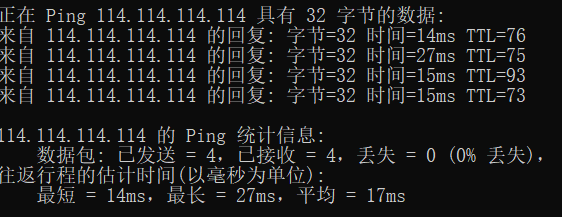
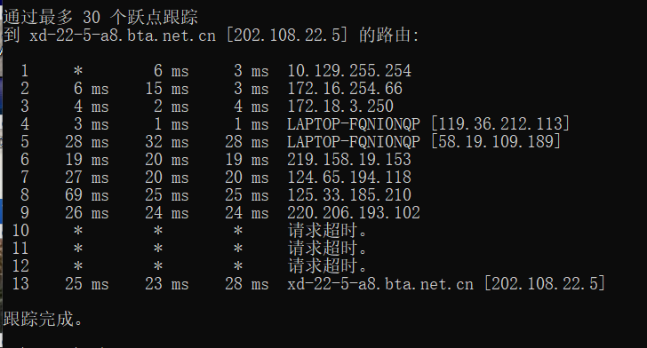

## 计算机网络作业1

### 实验一

#### 1.实验目的

运用`Ping`命令，`Ping`另一台计算机。

#### 2.`Ping`命令介绍

在网络中`Ping`是一个十分强大的TCP/IP工具。它的作用主要为：

- 用来检测网络的连通情况和分析网络速度；
- 根据域名得到服务器IP；
- 根据`Ping`返回的TTL值来判断对方所使用的操作系统及数据包经过路由器数量。

我们通常会用它来直接`ping IP地址`，来测试网络的连通情况。

命令格式及参数如下所示：

```
用法: ping [-t] [-a] [-n count] [-l size] [-f] [-i TTL] [-v TOS]
            [-r count] [-s count] [[-j host-list] | [-k host-list]]
            [-w timeout] [-R] [-S srcaddr] [-c compartment] [-p]
            [-4] [-6] target_name
选项:
    -t             Ping 指定的主机，直到停止。
                   若要查看统计信息并继续操作，请键入 Ctrl+Break；
                   若要停止，请键入 Ctrl+C。
    -a             将地址解析为主机名。
    -n count       要发送的回显请求数。
    -l size        发送缓冲区大小。
    -f             在数据包中设置“不分段”标记(仅适用于 IPv4)。
    -i TTL         生存时间。
    -v TOS         服务类型(仅适用于 IPv4。该设置已被弃用，
                   对 IP 标头中的服务类型字段没有任何
                   影响)。
    -r count       记录计数跃点的路由(仅适用于 IPv4)。
    -s count       计数跃点的时间戳(仅适用于 IPv4)。
    -j host-list   与主机列表一起使用的松散源路由(仅适用于 IPv4)。
    -k host-list    与主机列表一起使用的严格源路由(仅适用于 IPv4)。
    -w timeout     等待每次回复的超时时间(毫秒)。
    -R             同样使用路由标头测试反向路由(仅适用于 IPv6)。
                   根据 RFC 5095，已弃用此路由标头。
                   如果使用此标头，某些系统可能丢弃
                   回显请求。
    -S srcaddr     要使用的源地址。
    -c compartment 路由隔离舱标识符。
    -p             Ping Hyper-V 网络虚拟化提供程序地址。
    -4             强制使用 IPv4。
    -6             强制使用 IPv6。
```

#### 3.实验环境

- 版本：Windows 10
- 版本号：21H1
- 操作系统内部版本：19043.1526
- 体验：Windows Feature Experience Pack 120.2212.4170.0

#### 4.实验过程

1. 进入Windows命令提示符程序。

2. 在命令行中输入“`Ping`”, 并在后面加入一个IP地址。这里使用电信运营商的公共`DNS：114.114.114.114`。输入如下命令：

   ```cmd
   Ping 114.114.114.114
   ```

3. 得到的结果如下：

   

#### 5.实验结果解释

`bytes`值：数据包大小，也就是字节。

`time`值：响应时间，这个时间越小，说明你连接这个地址速度越快。

`TTL`值：Time To Live,表示DNS记录在DNS服务器上存在的时间，它是IP协议包的一个值，告诉路由器该数据包何时需要被丢弃。可以通过`Ping`返回的`TTL`值大小，粗略地判断目标系统类型是Windows系列还是UNIX/Linux系列。

从结果可以分析出，在给`114.114.114.114`发送4个32字节数据包的过程当中，返回了4个，没有丢失。这4个数据包中往返时间最短为14ms，最长为27ms，平均时间为17ms.


### 实验二

#### 1.实验目的

运用`tracert`命令，`tracert`一台服务器

#### 2.`tracert`命令介绍

用于确定IP数据报访问目标所采取的路径。使用IP生存时间`TTL`字段和`ICMP`错误来确认从一个主机到网络上其他主机的路由。

命令格式及参数如下所示：

```
用法: tracert [-d] [-h maximum_hops] [-j host-list] [-w timeout]
               [-R] [-S srcaddr] [-4] [-6] target_name
选项:
    -d                 不将地址解析成主机名。
    -h maximum_hops    搜索目标的最大跃点数。
    -j host-list       与主机列表一起的松散源路由(仅适用于 IPv4)。
    -w timeout         等待每个回复的超时时间(以毫秒为单位)。
    -R                 跟踪往返行程路径(仅适用于 IPv6)。
    -S srcaddr         要使用的源地址(仅适用于 IPv6)。
    -4                 强制使用 IPv4。
    -6                 强制使用 IPv6。
```

#### 3.实验环境

- 版本：Windows 10
- 版本号：21H1
- 操作系统内部版本：19043.1526
- 体验：Windows Feature Experience Pack 120.2212.4170.0

#### 4.实验过程

1. 进入Windows命令提示符程序。

2. 在命令行中输入“`Ping`”, 并在后面加入一个IP地址，可以查询从本机到该IP地址所在的电脑要经过的路由器及其IP地址。此处使用百度的ip地址为`202.108.22.5`为例：

   ```
   tracert 202.108.22.5
   ```

3. 得到的结果如下：

   

#### 5.实验结果分析

`tracert`命令返回的从左到右的5条信息分别代表了“生存时间”（每途经一个路由器结点自增1）、“三次发送的ICMP包返回时间”（共计3个，单位为毫秒ms，其中带有星号（*）的信息表示该次ICMP包返回时间超时）和“途经路由器的IP地址”（如果有主机名，还会包含主机名）。

以第5条返回信息为例：

```
5 28ms 32ms 28ms LAPTOP-FQNI0NQP [58.19.109.189]
```

探测到达`202.108.22.5`的路径，经过的第五个路由器的IP地址为`58.19.109.189`，三次发送的ICMP包的返回时间分别为28ms，32ms，28ms