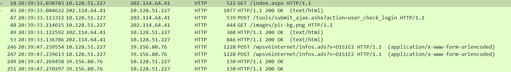

# 武汉大学计算机学院

# 实验报告

## 课程名称:       计算机网络 

## 专业年级:       2020级软件工程

## 姓名:           朱小东 

## 学号:           2020302111030 

#### Purpose:

Get to know the software Wireshark, learn and use Wireshark to analyze packets.

#### Experiment content 1

Under the protocol column in step7, we can find protocols such as TCP, HTTP, and ARP.

#### Experimental content 2

From the picture we can see that the HTTP GET message was sent at 20:39:33.030783, and the HTTP OK reply was received at 20:39:33.084622, which took 53.839ms

#### Experimental content 3

From the above picture we can see that the HTTP GET message is sent from 10.128.51.227 to 202.114.64.41; the HTTP OK reply is sent from 202.114.64.41 to 10.128.51.227.

So the network address of cs.whu.edu.cn is 202.114.64.41, and the local network address is 10.128.51.227

#### Experimental content 4

See wireshark_WLAN1EJWH1.pdf for the print content of HTTP GET message and HTTP OK reply

#### Conclusion
In this experiment, I understand, learn and practice the use of wireshark. Gain a deeper understanding of the transmission of packets.
